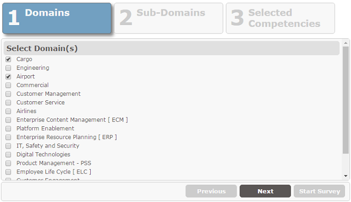
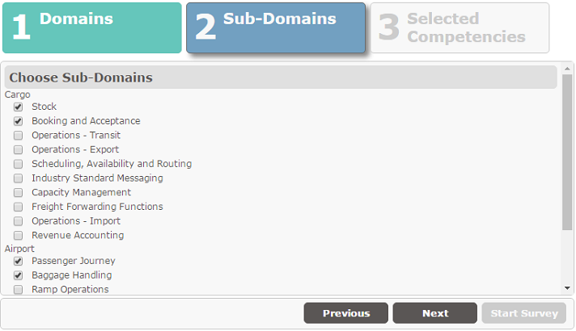
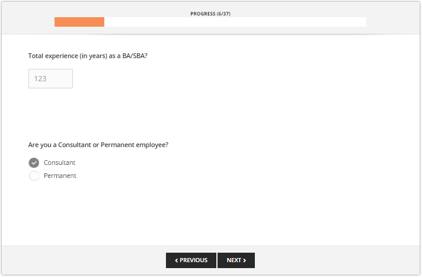

# Business Analyst Survey Application

The survey was created for gathering basic information from business analysts. Although this focuses on their domain and areas of expertise but some other questions are also asked in this survey.

[Application Url](http://infospace.emirates.com/newsites/BTS-BizSolDesign/SitePages/BA%20Survey.aspx)

> This application uses [jquery.wizard](http://www.jquery-steps.com/), [jquery](https://jquery.com/), [knockout](http://knockoutjs.com/) and [handsontable](https://handsontable.com/) as external components.

# Table of Contents
1. [Application Structure](#application-structure)
  * [Site Structure](#site-structure)
  * [Custom Lists](#custom-lists)
  * [Code Walk-Through](#code-walk-through)
  * [Information Architecture](#information-architecture)
  * [Reports](#reports)
  
3. [Credits](#credits)

## Application Structure
### Site Structure
The Site structure contains only the main site. 
> The site is based on the **Team Site** template

### Custom Lists
  1. [Domains](src/ListTemplates/Domains.stp)  
  2. [Sub-Domains](src/ListTemplates/Sub-Domains.stp)
    __Dependencies:__  
	* _Domains_
  3. [Survey Questions](src/ListTemplates/Survey Questions.stp)  
    __Dependencies:__  
	* _Sub-Domains_
	* _Domains_
  4. [Survey Responses](src/ListTemplates/Survey Responses.stp)  
    __Dependencies:__  
	* _Survey Submissions_
  5. [Survey Submissions](src/ListTemplates/Survey Submission.stp)  
    __Dependencies:__  
	* _Sub-Domains_
	* _Domains_

### Application Walk-Through

The main screen prompts the user to select their domain area and then sub-domains in a wizard based style.

Choose sub-domains from the main selected domain

The users complete the survey. The progress indicator is helpful to identify how long it is going to take

### Information Architecture
* Each completed survey along with the selected Domain and Sub-Domain is stored in the __User Submissions__ list
* The responses to each question are stored in the __Survey Responses__ list
* Questions are stored in the __Survey Questions__
* The Domains are stored in the __Domains__ list
* The Sub-Domains are stored in the __Sub-Domains__ list

### Reports
* This application does include an extensive reporting function. Standard *Excel List Export* is used

## Credits

**Shahnawaz Sarwar**

- <mailto:s716345@emirates.com>

**Muhammad Usman**